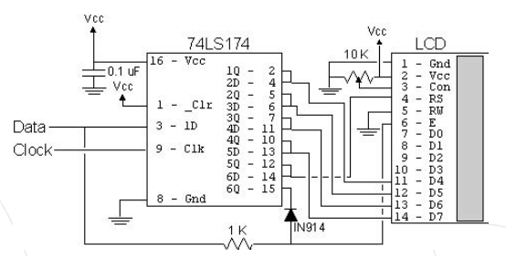

# E48_227_2bitLCD

This is a simple improvisation of the "Experiment 48: 2-bit LCD" from Myke Predko's *123 PIC Microcontroller Experiments for the Evil Genius*. Instead of a PIC microcontroller, Arduino is used in this experiment.

Connect the Clock to pin 3 and the Data to pin 2 of the Arduino.

You can refer to the old webpage and the schematic [there]( https://web.archive.org/web/20070105052837/http://www.rentron.com/Myke1.htm).

The code from pages 127, 128 and 227 are slightly modified to have these run good at Arduino platform.
